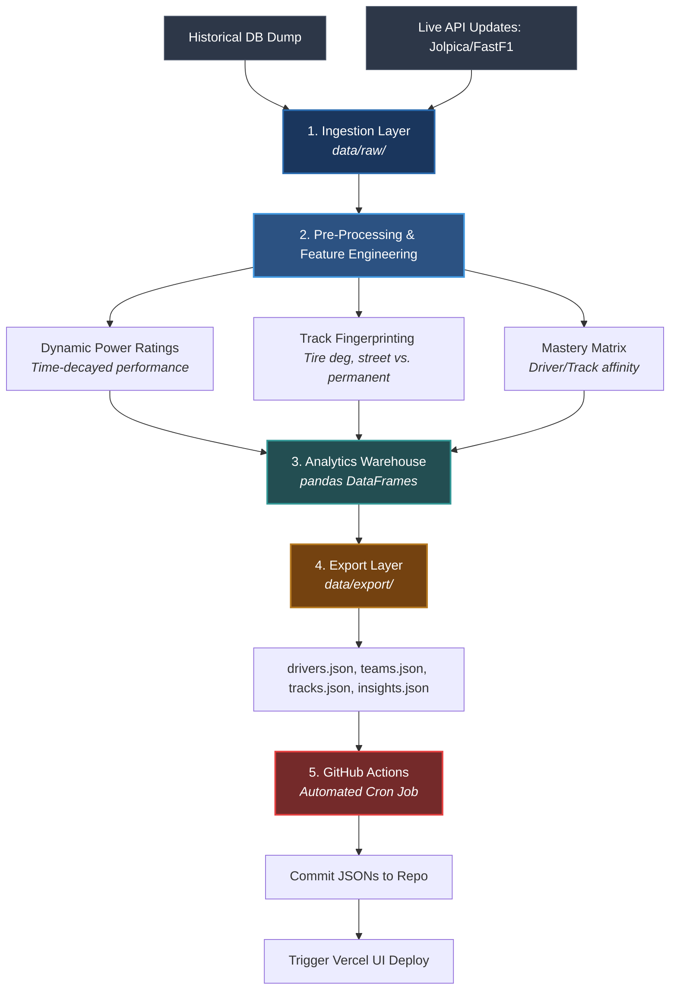

# 🏎️ Fanalytics Data Engine

[](https://github.com)
[](https://python.org)
[](https://github.com)

A high-performance, standalone Python ETL (Extract, Transform, Load) pipeline. It ingests historical and live Formula 1 data, engineers advanced analytical features, and exports optimized static JSON assets to power the **Fanalytics React Dashboard**.

---

## 🏗️ Architecture & Data Flow



---

## 📂 Directory Structure

```text
analytics_engine/
│
├── .github/workflows/
│   └── pipeline.yml          # GitHub Actions CI/CD cron scheduler
│
├── data/
│   ├── raw/                  # Immutable raw CSVs & bootstrapped assets
│   └── export/               # Production-ready JSONs for React frontend
│
├── src/
│   ├── ingestion/
│   │   ├── bootstrap.py      # One-time historical database seeder
│   │   └── update.py         # Incremental live API fetcher for recent GPs
│   │
│   ├── features/
│   │   ├── track_profile.py  # Tire degradation proxies & circuit typing
│   │   ├── power_ratings.py  # Time-decayed team & driver momentum engines
│   │   └── mastery.py        # Driver strengths/weaknesses matrix per track
│   │
│   └── export/
│       └── json_builder.py   # Formats payloads to match React TypeScript interfaces
│
├── main.py                   # Global Orchestrator (Executes full ETL sequence)
├── requirements.txt          # Python runtime dependencies
└── README.md                 # Project documentation
```

---

## 📊 Engineered Features (Phase 1)

*   **Tire Degradation Index** 
    Calculates dynamic degradation proxies by aggregating and filtering historical pit-stop windows exclusively under dry racing conditions.
*   **Time-Decayed Form Factor** 
    Applies an exponential time-decay algorithm to recent Grand Prix placements. Recent weekend forms are weighted heavier than early-season points to accurately map current team/driver momentum.
*   **Track Suitability Matrix** 
    Cross-references a driver's historical scoring metrics against specific structural track profiles (e.g., *High-Degradation Street Circuits* vs. *Low-Degradation Permanent Tracks*).

---

## ⚙️ Automated GitHub Actions Workflow

The engine operates entirely hands-free in the cloud via automated infrastructure.

```yaml
Trigger: 🕒 Every Monday at 08:00 UTC (Post-Race Weekend)
```

1.  **Environment Provisioning:** Spins up an isolated, ephemeral Ubuntu container.
2.  **Dependency Setup:** Installs Python environment and cached `requirements.txt` targets.
3.  **Pipeline Orchestration:** Executes `main.py` to target, fetch, and process the latest race weekend data.
4.  **Asset Generation:** Overwrites local feature states and rebuilds static data in `data/export/`.
5.  **Autonomous Deployment:** Automatically signs, commits, and pushes modified tracking JSONs back to `main`, instantly triggering your frontend Vercel deployment hook.
